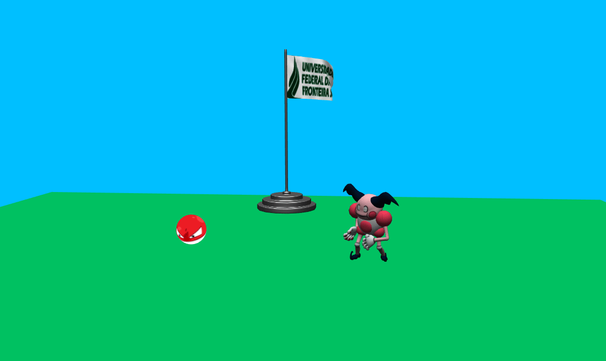

# WebGL and ThreeJs Demo


[See Live](https://jovanidesouza.github.io/threejs-demo/)

---




## How To Use
From your command line:
```
# Clone this repository
$ git clone https://github.com/jovanidesouza/threejs-demo

# Go into the repository
$ cd threejs-demo

# Remove current origin repository
$ git remote remove origin

```

To run the demo, open `index.html` with a [Live Server](https://marketplace.visualstudio.com/items?itemName=ritwickdey.LiveServer).
